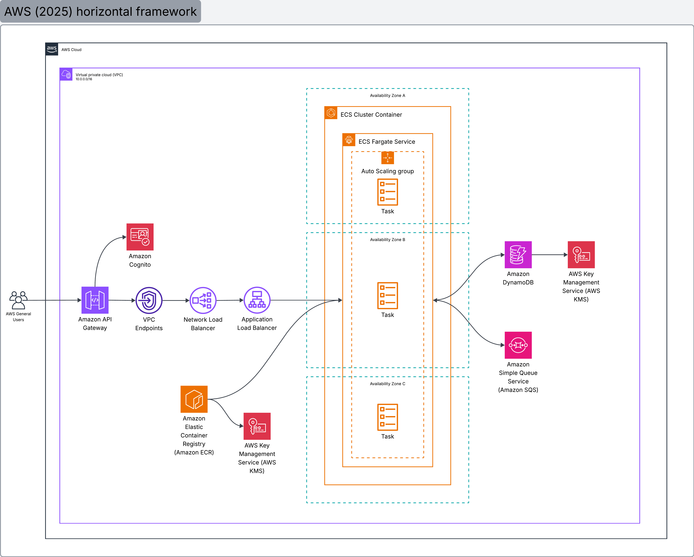

# Nequi Tech Challenge - Ticketing System API

Microservicio backend reactivo diseñado para gestionar la disponibilidad, procesamiento de compras y liberación de
tickets para eventos. Planteando solución al desafío técnico.

## 🛠️ Stack Tecnológico
* **Lenguaje:** Java 25
* **Framework:** Spring Boot 4.x (WebFlux / Project Reactor)
* **Cloud & Infraestructura:** AWS SDK v2 (Async), DynamoDB, SQS
* **Resiliencia:** Resilience4j (Circuit Breaker)
* **Testing:** Junit, Mockito, reactor-test
* **Herramientas:** Gradle, MapStruct, Lombok, LocalStack, Docker Compose

## Arquitectura de Solución



## 🏗️ Decisiones de Diseño

### 1. Arquitectura Hexagonal y Domain-Driven Design (DDD)
Se utilizó el estándar de *[Scaffold de Bancolombia](https://bancolombia.github.io/scaffold-clean-architecture/docs/intro)*
con la finalidad de mantener las siguientes consideraciónes;
* **Aislamiento del Dominio:** Garantizar que las reglas de negocio (entidades y casos de uso) no tengan dependencias
con tecnologías externas.
* **Inversión de Dependencias (DIP):** La interacción de la lógica de negocio (capa de dominio) con la base de datos y
la mensajería se efectúa por medio de interfaces. La implementación real (DynamoDB, SQS) ocurre en los `Driven Adapters`,
facilitando el testing aislado mediante Mocks y permitiendo el desligamiento tecnológico sin afectar el core de negocio.

[Clean Architecture — Aislando los detalles](https://medium.com/bancolombia-tech/clean-architecture-aislando-los-detalles-4f9530f35d7a)


### 2. Base de Datos: Single-Table Design y Control de Concurrencia (DynamoDB)
* **Modelado NoSQL:** Se implementó el patrón **Single-Table Design** de DynamoDB con el fin de optimizar rendimiento.
Entidades dispares como `Event`, `Order` y `Ticket` conviven en una unica tabla `ticketing-table-dev` diferenciadas por
llaves compuestas (`pk`, `sk`) y un Global Secondary Index (`EntityTypeIndex`) para satisfacer todos los patrones de
acceso en consultas, reduciendo complejidad y saltos de red.
* **Optimistic Locking y Transacciones ACID:** Con la finalidad de evitar la sobreventa en entornos altamente
transaccionales, se implementaron transacciones atómicas [(`TransactWriteItems`)](https://docs.aws.amazon.com/amazondynamodb/latest/developerguide/transaction-apis.html#transaction-apis-txwriteitems) respaldadas por expresiones de
condición (`ConditionExpression`). Al actualizar una orden o ticket, DynamoDB válida el estado previo a nivel de motor
de base de datos, rechazando peticiones concurrentes que intenten modificar el mismo ticket.

### 3. Procesamiento de Nuevas Órdenes (SQS FiFo Queue):
* **FiFo Queue:** Desacopla la validación compleja de disponibilidad de tickets de la generación de nuevas órdenes,
reserva los tickets requeridos y actualiza el estado de la orden.
* **Dead Letter Queue (DLQ):** La cola FIFO principal cuenta con un *Redrive Policy*. Si el procesamiento de una orden
de pago falla repetidamente por un error transitorio de infraestructura, el mensaje es degradado a la DLQ para 
intervención manual o reprocesamiento, asegurando cero pérdida de datos.


### 4. Event-Driven Expiration (SQS)
* **Gestión de TTL sin Cron Jobs:** Con el objetivo de evitar procesos *batch* consultando órdenes expiradas cada
minuto, se implementó un flujo orientado a eventos para gestionar la expiración de órdenes y libración de tickets.
* **Release Delay Queue:** Una vez efectuada la reserva de tickets, se publica un mensaje en una cola estándar SQS
con un *Delay* equivalente al tiempo de gracia para el pago (ej. 10 minutos). Cuando el mensaje se vuelve visible
y es consumido por el listener de la aplicación, iniciando un proceso de validación de estado de la orden;
si no está pagada o en estado confirmada (`CONFIRMED`), ejecuta una transacción ACID compensatoria para liberar
los tickets transitándolos del estado (`RESERVED`) a (`AVAILABLE`) y expirar la orden correspondiente (`EXPIRED`).

### 5. Tolerancia a Fallos
* **Circuit Breaker Inteligente:** Implementado con *Resilience4j*, con la finalidad de proteger el servicio ante fallos
reiterativos por indisponibilidad de ambiente, permitiendo una estabilización del mismo. Se ignoran excepciones
de negocio mediante la propiedad (`ignoreExceptions`) para que no sumen a la tasa de fallos, evitando la apertura
accidental del circuito ante errores del cliente.


---

## ⚖️ Trade-Offs (Compromisos Arquitectónicos)

### 1. Latencia vs. Consistencia Fuerte en la Creación de Eventos:
* **Decisión:** Al crear un evento, la generación masiva de tickets (ej. 10,000 tickets) se ejecuta en un flujo
reactivo asíncrono para no bloquear la respuesta HTTP al cliente.
* **Trade-off:** Si se presenta un fallo en la generación de tickets después de responder `201 Created`, la creación
el evento no se encontrara publicado (`PUBLISHED`) para la compra de Tickets, y se actualizara el estado
del mismo a fallido (`FAILED`)
* **Evolución futura:** Encolar un comando (`CreateTicketsCommand`) en SQS para garantizar la consistencia eventual 
y la resiliencia ante caídas del pod.

### 2. Manejo de Errores con DLQ (Dead Letter Queues):
* **Decisión:** Integración de una política de reintentos (*Redrive Policy*) en SQS.
* **Trade-off:** Añade complejidad operativa. Si un mensaje falla 3 veces por errores transitorios, se aísla en la DLQ,
requiriendo mecanismos de reprocesamiento manual o alertas operativas.

## ⚙️ Requisitos Previos

Para ejecutar este proyecto de manera local, es necesario contar con:
* **Java 25** (JDK)
* **Docker y Docker Compose**


## 🚀 Ejecución del Proyecto

El proyecto está diseñado para levantar todo el ecosistema (Aplicación, Base de Datos, Colas y UI de monitoreo BD) 
con los siguientes pasos:

### 1. Clonar repositorio:
```bash
git clone https://github.com/IvanSH7/nequi-backend-tech-challenge-ms.git
cd nequi-backend-tech-challenge-ms
```

### 2. Compilado de la aplicación:
En la raíz del proyecto, se debe ejecutar el wrapper de Gradle para construir el `.jar`:

```bash
./gradlew clean build 
```

### 2. Despliegue infraestructura:
En la raíz del proyecto se levantará él `docker-compose.yml` el cual se encargara de construir la imagen a partir
del `.jar`, empaquetando la app, un health check configurado en el compose asegurará que LocalStack haya creado la
tabla DynamoDB y colas SQS antes de iniciar la applicación de Spring Boot.

```bash
docker-compose up --build -d
```
Una vez completado el proceso de despliegue el API estará aceptando peticiones en http://localhost:9090

## 📊 Monitoreo y Observabilidad Local
Para auditar el estado del sistema, el docker-compose.yml expone las siguientes herramientas:

### Logs del aplicativo:

```bash
docker logs -f nequi-backend-app
```

### DynamoDB Admin UI:

Se puede explorar visualmente la tabla Dynamo, los eventos, tickets y órdenes abriendo en el navegador: http://localhost:8001

## 🛑 Detener el entorno
Para detener la aplicación y limpiar la red de contenedores:

```bash
docker-compose down
```
